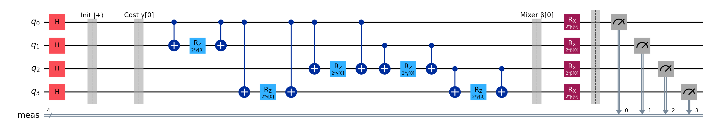
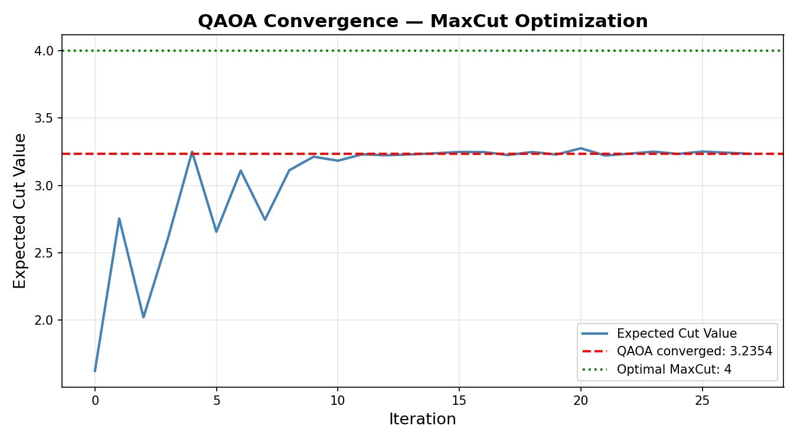
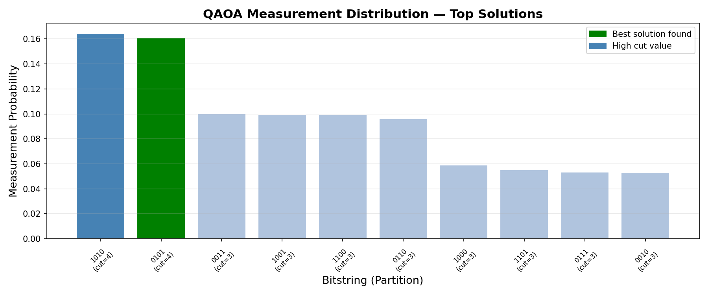
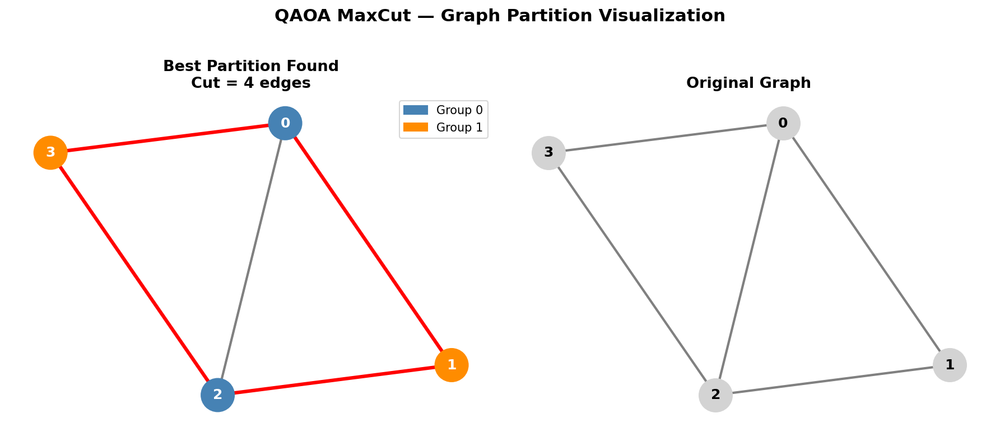
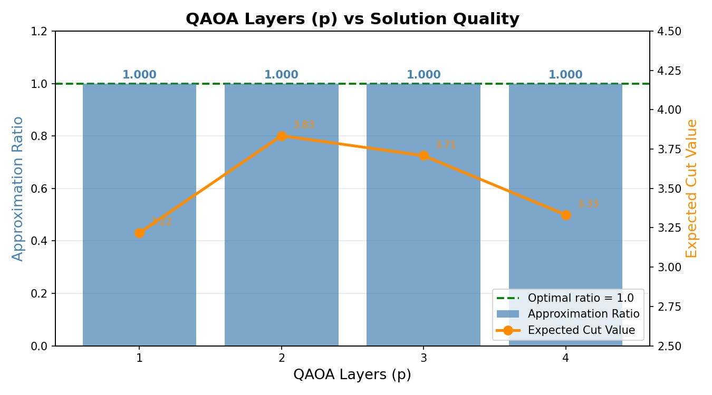

# QAOA MaxCut



## Overview

MaxCut is one of the most well-known NP-hard combinatorial optimization
problems. Given a graph, the goal is to partition nodes into two groups
such that the number of edges between groups is maximized. Classical
algorithms struggle with this at scale. QAOA (Quantum Approximate
Optimization Algorithm) is a hybrid quantum-classical algorithm designed
specifically for problems like this — and it's one of the most promising
near-term quantum algorithms.

This project implements QAOA from scratch using Qiskit, runs it on a
4-node graph, and experiments with circuit depth, shot count, and
solution quality.

## Problem Statement

Can QAOA find the optimal MaxCut partition on a 4-node graph? How does
the number of QAOA layers (p) affect solution quality? And how many
shots do you actually need for reliable results?

## Method

- **Graph:** 4-node graph with 5 edges — optimal MaxCut = 4
- **Circuit:** p layers of cost unitary (ZZ interactions) + mixer
  unitary (RX rotations), initialized in equal superposition
- **Optimizer:** COBYLA (gradient-free, scipy)
- **Cost function:** Expected cut value across all measurement outcomes
- **Brute force verification:** All 2^4 = 16 partitions checked

## Experiment

Three experiments were conducted:

| Experiment | Variable | Range |
|---|---|---|
| 1 | QAOA convergence (p=1) | 0 → 100 iterations |
| 2 | QAOA layers (p) | 1 → 4 |
| 3 | Shot count | 64 → 4096 |

## Results

### QAOA Convergence

QAOA converged with expected cut = 3.24 and found the optimal
partition (cut = 4) with approximation ratio = 1.0. The most
frequently measured bitstring was 1010 — equivalent to the
optimal partition 0101.



### Measurement Distribution

The optimal solutions (1010 and 0101) were measured most frequently,
confirming that QAOA correctly amplifies the probability of high-cut
partitions over low-cut ones.



### Graph Partition

The best partition found puts nodes {0, 2} in one group and {1, 3}
in the other — cutting all 4 edges of the cycle and one diagonal.



### p-Layers vs Solution Quality

Approximation ratio = 1.0 at all depths. Expected cut improves from
3.23 at p=1 to 3.84 at p=2, then slightly drops at p=3 and p=4 due
to the barren plateau effect in deeper circuits.



## Conclusion

QAOA successfully found the optimal MaxCut partition with 100%
approximation ratio even at p=1. The expected cut value — which
reflects how often the optimal solution appears in measurements —
improves with p up to a point. For this simple graph, p=2 gives the
best balance of quality and efficiency. The barren plateau effect
begins to show at p=4, a known challenge for deeper QAOA circuits.

## How to Run
```bash